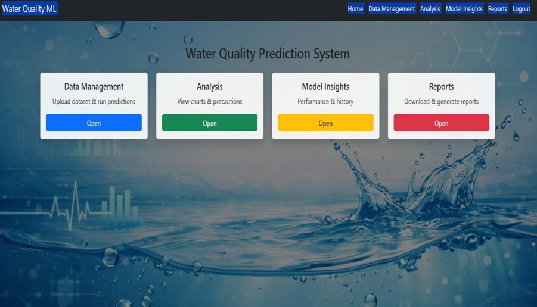
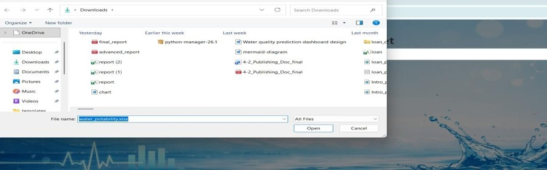
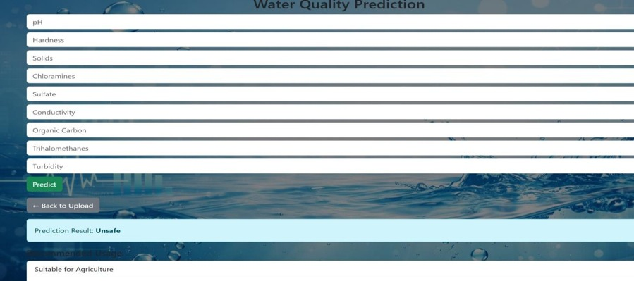
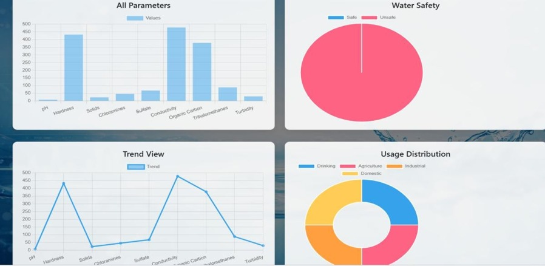
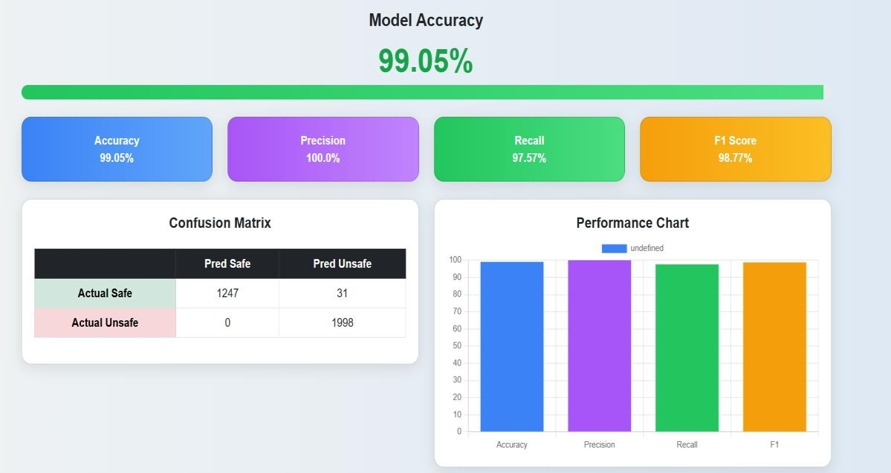
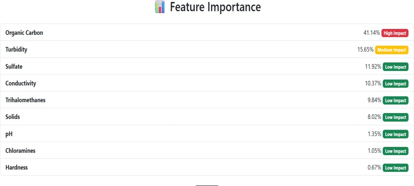

# 💧 Water Quality Prediction using Machine Learning

An intelligent Machine Learning application that predicts water quality based on various water parameters and classifies whether the water is suitable for drinking.

---

## 📌 Project Overview

This project uses Machine Learning algorithms to analyze water quality parameters and predict whether water is safe for consumption.

The application provides an easy-to-use web interface where users can enter water parameters and instantly receive predictions.

---

## 🎯 Features

- Water Quality Prediction
- User Friendly Interface
- Machine Learning Model
- Data Visualization
- Fast Predictions
- Responsive Design

## 📸 Project Screenshots

### Dashboard


### Data Upload


### Prediction


### Analysis


### Model Accuracy


### Feature Importance


---


## 🛠 Technologies Used

### Programming Language
- Python

### Machine Learning
- Scikit-learn
- Pandas
- NumPy

### Visualization
- Matplotlib
- Seaborn

### Web Framework
- Flask
- HTML
- CSS
- JavaScript

### Database
- SQLite

---

## 📂 Project Structure

```
water-quality-prediction/
│
├── static/
├── templates/
├── app.py
├── model.py
├── users.db
├── final_report.pdf
└── README.md
```

---

## Machine Learning Workflow

1. Data Collection
2. Data Preprocessing
3. Feature Engineering
4. Model Training
5. Model Evaluation
6. Water Quality Prediction

---

## Evaluation Metrics

- Accuracy
- Precision
- Recall
- F1 Score

---

## Future Improvements

- Deep Learning Models
- Real-time Sensor Integration
- Cloud Deployment
- Mobile Application
- Interactive Dashboard

---

## Author

**Sreya Rao**

LinkedIn:
https://linkedin.com/in/sreyarao24

GitHub:
https://github.com/Sreyarao204

---